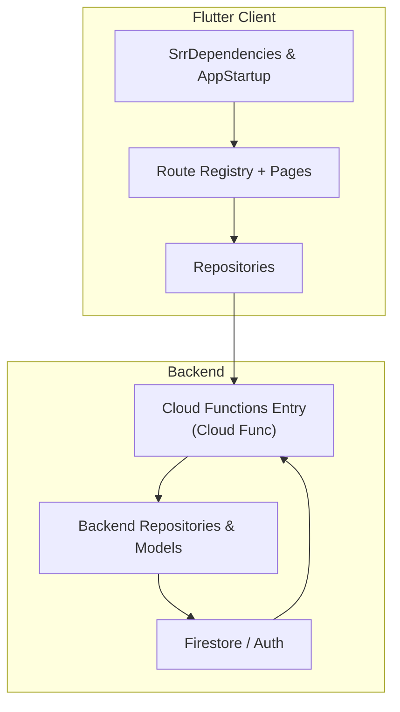
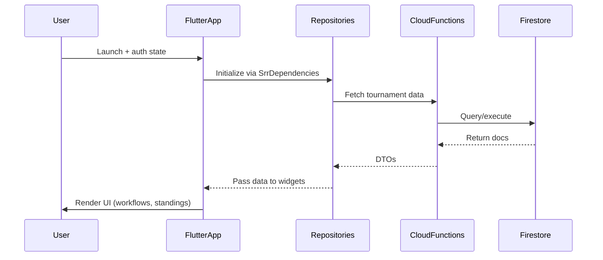
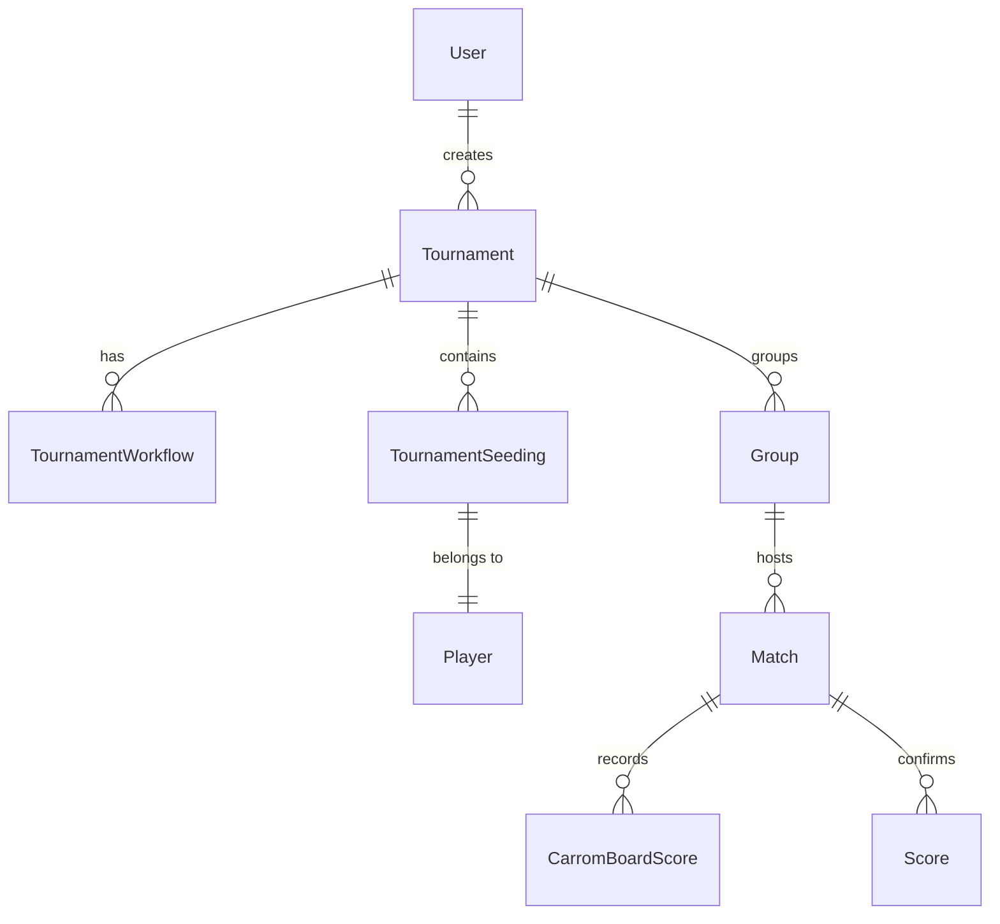
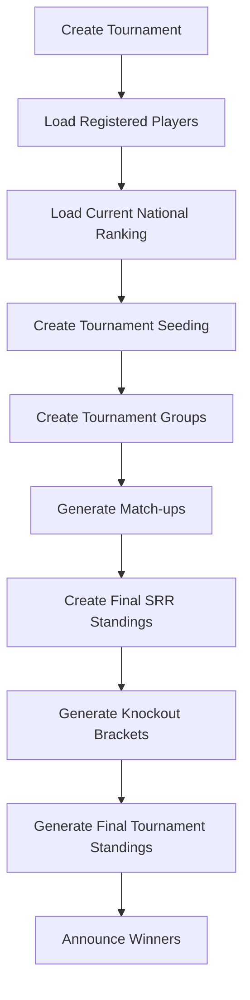

# Carrom SRR App Architecture

## Overview
The SRR (Swiss Round Robin) app is structured to demonstrate production-grade thinking similar to large-scale Google services: explicit dependency graphs, clearly articulated layers, observable state transition points, and a modular backend. The goal of this document is to surface those architectural choices, tie each principle back to the actual codebase, and highlight how future work can extend the system safely.

## Architectural Layers
| Layer | Description | Key Files / Patterns |
| --- | --- | --- |
| **Bootstrap & DI** | Entry points remain minimal. `main.dart` wires `AppStartup`, which delegates Firebase initialization to `SrrAppBootstrapper` and bootstrap dependencies through `SrrDependencies`. | `lib/main.dart`, `lib/core/bootstrap/app_startup.dart`, `lib/core/bootstrap/app_startup.dart`, `lib/core/bootstrap/srr_app_bootstrapper.dart`, `lib/src/di/srr_dependencies.dart` |
| **Presentation** | UI screens only see repositories/services. Widgets request their dependencies through the `SrrRouteRegistry`, and shared helpers (markdown viewer, split-action buttons, scaffolds) sit under `lib/src/ui/helpers/`. | `lib/src/ui/routes/srr_route_registry.dart`, `lib/src/ui/bootstrap/srr_bootstrap_page.dart`, `lib/src/ui/tournament/srr_tournament_setup_page.dart`, `lib/src/ui/helpers/srr_page_scaffold.dart` |
| **Repositories & APIs** | Repositories, not UI widgets, interact with `SrrApiTransport`. Each repository exposes domain-friendly methods (`fetchActiveTournamentStatus`, `publishMatchup`, etc.) and maps JSON payloads to immutable `lib/src/models/*` DTOs before returning them to the UI. | `lib/src/repositories/srr_tournament_repository.dart`, `lib/src/api/srr_tournament_api.dart`, `lib/src/models/srr_tournament_models.dart`, `lib/src/models/srr_match_models.dart` |
| **Theming & Preferences** | Theme/display state lives inside controllers (`SrrThemeController`, `SrrDisplayPreferencesController`), and the `SrrUserPreferencesCoordinator` serializes choice persistence so pages just listen to `Listenable`/`ChangeNotifier`. | `lib/src/theme/srr_theme_controller.dart`, `lib/src/theme/srr_display_preferences_controller.dart`, `lib/src/theme/srr_user_preferences_coordinator.dart`, `lib/src/ui/helpers/srr_settings_page.dart` |
| **Backend Functions** | Cloud Functions mirror the modular organization. Domain models are split into `functions/src/models/*`, repository operations live under `functions/src/repositories/*`, and `functions/src/index.ts` wires the exact helpers needed for each endpoint instead of relying on a single bulky client. | `functions/src/models/*.ts`, `functions/src/repositories/*.ts`, `functions/src/index.ts`, `functions/src/helpers/utils.ts` |

## Principles Applied (with Code References)
1. **Dependency Injection** – Flutter routes request dependencies through `SrrRouteRegistry.buildRoutes`, which receives a fully-constructed `SrrDependencies` object. On the backend, `functions/src/index.ts` instantiates repositories (`UsersRepository`, `TournamentsRepository`, etc.) once and injects them into each handler.
2. **Separation of Concerns** – UI components do not contain business logic. For example, `SrrTournamentSetupPage` renders workflow steps but delegates data mutations to `SrrTournamentRepository.createTournament`. Backend logic is split across repository helpers (see `functions/src/repositories/tournaments_repository.ts`) and helper utilities (`functions/src/helpers/utils.ts`).
3. **Observable State** – Theme and display preferences controllers expose `ChangeNotifier` interfaces so widgets rebuild only when relevant state changes; the Settings page (`lib/src/ui/helpers/srr_settings_page.dart`) listens to `Listenable.merge([themeController, displayPreferencesController])`.
4. **Immutable DTOs** – Models under `lib/src/models/` are annotated with `const` constructors and guard against malformed JSON. Example: `SrrTournamentSeedingRow.fromJson` ensures ranking metadata remains normalized before the UI renders.
5. **Composition over Inheritance** – There are no massive base classes. Features are assembled by wiring lightweight dependencies (transport + repositories + controllers) together and passing them to widgets. The `SrrDependencies` constructor centralizes that composition.
6. **Prod Safety & Observability** – Logging and crash capture is centralized via `AppStartup`’s `_installRuntimeLogCapture`, and analytics hooks live in `AppFrameworkDependencies`. Backend TypeScript enforces typed parameters in `functions/src/helpers/utils.ts` and runs ESLint with the `npm run lint` script.

## Deployment & Operations
- **Flutter builds** rely on `dart-define` flags so API URLs, OAuth client IDs, and theme defaults stay reproducible (`SrrRuntimeEnv` picks these up). 
- **Firebase Functions** run `npm run lint` and `npm run build` before deployment. Backend scripts use the `scripts/deploy_*.sh` wrappers already present in the repo so deployments follow a documented flow. 
- **Hosting & API** – Firestore rules and Cloud Functions share the same `functions/src/config/runtime_config.ts`, keeping security in sync across staging/production targets.

## Observability & Testing
- **Flutter**: `flutter analyze` ensures no analyzer rules fail, and `RuntimeLogStore` accumulates logs during startup for future export. 
- **Functions**: `npm run lint` with the newly added ESLint config guards TypeScript hygiene. The modular repository layout keeps each helper easy to unit test.

## Application Flow
1. **Cold start** – `main.dart` runs `AppStartup.initialize`, `SrrAppBootstrapper` initializes Firebase, and `SrrDependencies` builds the reusable graph (`lib/src/di/srr_dependencies.dart`). `SessionWatcher` monitors auth state and the route registry drives navigation via `AppRoutes.bootstrap` → `SrrBootstrapPage`. Refer to `lib/src/ui/bootstrap/srr_bootstrap_page.dart` for first-screen decisions.
2. **Auth and profile** – Auth flows leverage `SrrAuthService`, which wraps `SrrAuthRepository` for session persistence and helper classes (`EmailAuthHelper`, `GoogleAuthHelper`, `AppleAuthHelper`) for provider interactions (`lib/src/auth/srr_auth_service.dart`). On successful auth, the user is directed to `SrrCompleteProfilePage` if their profile is incomplete (`lib/src/ui/signin/srr_complete_profile_page.dart`).
3. **Tournament experience** – Admins land on `SrrTournamentSetupPage`, players view rankings, and match reporting happens through `SrrRoundMatchupPage`. Each page works through repositories (`SrrTournamentRepository`, `SrrPlayerRepository`, `SrrDashboardRepository`) to hit remote APIs (`lib/src/api/srr_*`). Workflows (catalog, upload, seeding, groups, matchups) are orchestrated through base components/controls under `lib/src/ui/tournament/`.
4. **Theme & settings updates** – Settings page listens to `SrrThemeController` and `SrrDisplayPreferencesController` to mutate preferences via `SrrUserPreferencesCoordinator`, so theme changes propagate app-wide without widget-level logic (`lib/src/ui/helpers/srr_settings_page.dart`).
5. **Backend sync** – Cloud Functions respond to API calls using repositories (`functions/src/repositories/*`). Models in `functions/src/models/*` match those in the Flutter client, allowing DTO reuse. Every function receives the narrow repository set it needs before executing logic in `functions/src/index.ts`.

# Diagrams
### Architecture Layer Diagram

### Application Flow Sequence

## Summary
The SRR app mirrors production-grade architecture by keeping entry points lean, enforcing dependency injection, and isolating domain logic inside repositories/models on both client and backend. Every future feature should plug into the existing DI graph (`SrrDependencies`/`functions/src/index.ts`) and follow the per-layer conventions documented above.
## Data Model Overview
- Shared DTOs under `lib/src/models/*` mirror the backend `functions/src/models/*` files, keeping fields aligned for serialization.
- Key entities:
  1. **User / Player** – `SrrUser` (`lib/src/models/srr_users.dart`) / `UserModel` (`functions/src/models/user_models.ts`).
  2. **Tournament + Metadata** – `SrrTournamentRecord`/`SrrTournamentMetadata` (`lib/src/models/srr_tournament_models.dart`) vs `TournamentModel`/`TournamentMetadataModel` (`functions/src/models/tournament_models.ts`).
  3. **Seeding / Groups** – `SrrTournamentSeedingRow`, `SrrTournamentGroupsSnapshot` (`srr_tournament_models.dart`) with backend `TournamentSeedingModel`, `TournamentGroupModel`.
  4. **Matches / Scores** – `SrrMatch`, `SrrRound`, `SrrScoreConfirmation` (client) align with `MatchModel`, `ScoreModel`, `CarromBoardScoreModel` (backend).

## Workflow Map
- The workflow enforced by `SrrTournamentWorkflow` (`lib/src/models/srr_tournament_models.dart`) and `SrrTournamentWorkflowStepKey` ensures admins push through the same stages.
- Backend `TournamentGroupsRepository` and `TournamentSeedingsRepository` mirror these steps with functions invoked in `functions/src/index.ts` during each workflow action (`createTournament`, `loadRegisteredPlayers`, etc.).

## Summary
