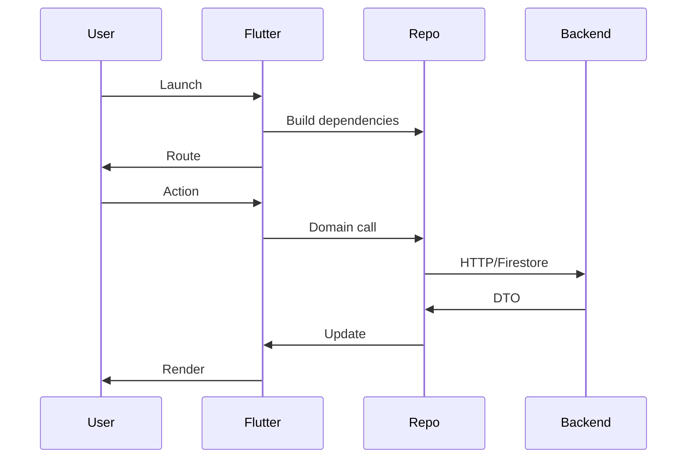
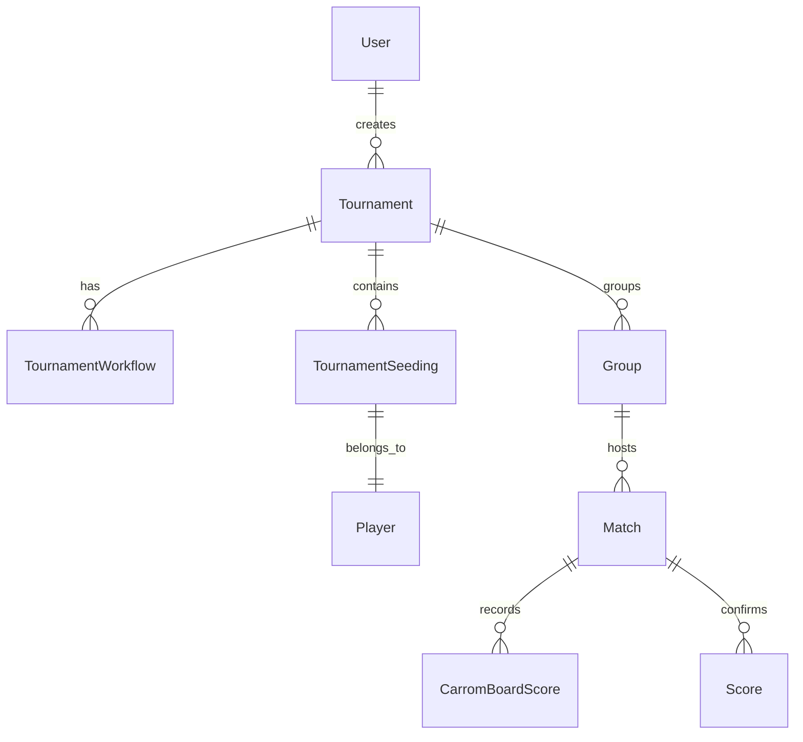
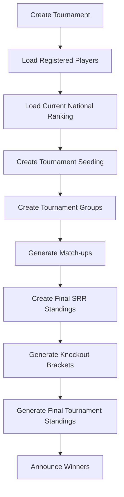

# Carrom SRR Architecture Deck

---

## Slide 1 • Overview
* Production principles: DI, SOC, observable state
* Modular Flutter + TypeScript backend
* Reuse DI graph + shared DTOs

---

## Slide 2 • Layers & References
| Layer | Files |
| --- | --- |
| Bootstrap / DI | `lib/main.dart`, `lib/core/bootstrap/*`, `lib/src/di/srr_dependencies.dart` |
| Presentation | `lib/src/ui/routes/srr_route_registry.dart`, `lib/src/ui/bootstrap/srr_bootstrap_page.dart`, `lib/src/ui/helpers/srr_page_scaffold.dart` |
| Repositories / APIs | `lib/src/repositories/srr_tournament_repository.dart`, `lib/src/api/srr_tournament_api.dart`, `lib/src/models/srr_tournament_models.dart` |
| Theming | `lib/src/theme/srr_theme_controller.dart`, `lib/src/theme/srr_display_preferences_controller.dart`, `lib/src/ui/helpers/srr_settings_page.dart` |
| Backend Functions | `functions/src/models/*.ts`, `functions/src/repositories/*.ts`, `functions/src/index.ts`, `functions/src/helpers/utils.ts` |

---

## Slide 3 • Principles in Code
1. DI via `SrrRouteRegistry.buildRoutes` + `SrrDependencies`
2. SOC: `SrrTournamentSetupPage` → `SrrTournamentRepository`
3. Observable state: Settings page listens to `Listenable.merge` on controllers
4. Immutable DTOs in `lib/src/models/*`; backend mirrors them in `functions/src/models/*`
5. Composition: `SrrDependencies` centralizes wiring
6. Prod safety: `AppStartup` log capture + `npm run lint`

---

## Slide 4 • Application Flow

---

## Slide 5 • Data Model

Key pairs: `SrrUser` ↔ `UserModel`, `SrrTournamentRecord` ↔ `TournamentModel`, `SrrMatch` ↔ `MatchModel`, workflow steps match `TournamentWorkflowStepKey`.

---

## Slide 6 • Workflow Map

Connections implemented in `SrrTournamentWorkflow` and backend repositories `TournamentSeedingsRepository`, `TournamentGroupsRepository`, etc.

---

## Slide 7 • Deployment & Observability
* Flutter: `dart-define` flags -> `SrrRuntimeEnv` + `flutter analyze`
* Backend: `npm run lint`, `npm run build`, `functions/src/index.ts` handlers use typed repos
* Shared runtime config in `functions/src/config/runtime_config.ts`
* Logs: `RuntimeLogStore`, `AppFrameworkDependencies`

---

## Slide 8 • Summary
* Keep DI graph lean
* Keep UI → repository only
* Mirror DTOs between Flutter and backend
* Lint/test before deploy
* Diagrams and doc available in `docs/`
